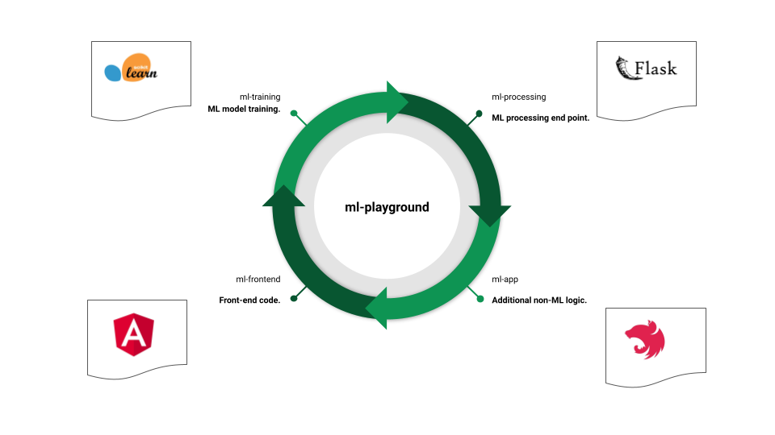
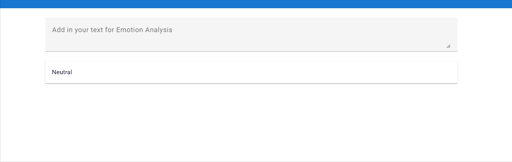

<!-- PROJECT LOGO -->
<br />
<div align="center">
  <a href="https://github.com/ml-cloud-playground/ml-cloud-playground">
    
  </a>

  <h3 align="center">Cloud Machine Learning Playground</h3>

  <p align="center">
    A set of cloud-agnostic projects to train, process and serve ML algorithms.
  </p>
</div>


<!-- TABLE OF CONTENTS -->
<details>
  <summary>Table of Contents</summary>
  <ol>
    <li>
      <a href="#about-the-project">About The Project</a>
      <ul>
        <li><a href="#built-with">Built With</a></li>
      </ul>
    </li>
    <li>
      <a href="#getting-started">Getting Started</a>
      <ul>
        <li><a href="#prerequisites">Prerequisites</a></li>
        <li><a href="#installation">Installation</a></li>
      </ul>
    </li>
    <li><a href="#roadmap">Roadmap</a></li>
    <li><a href="#contributing">Contributing</a></li>
    <li><a href="#license">License</a></li>
    <li><a href="#contact">Contact</a></li>
    <li><a href="#acknowledgments">Acknowledgments</a></li>
  </ol>
</details>


<!-- ABOUT THE PROJECT -->
## About The Project

<a href="https://github.com/ml-cloud-playground/ml-cloud-playground">
    
  </a>

ML Cloud playground is a set of exploratory code built to train, process and serve machine learning algorithms in a cloud-agnostic way. This is meant to be a learning tool, if you like where it is going and want to add more support for other platforms please fork and contribute.


<p align="right">(<a href="#readme-top">back to top</a>)</p>

### High level view
- A set of text and emotions from [Emotion Classification NLP](https://www.kaggle.com/datasets/anjaneyatripathi/emotion-classification-nlp/code) for training the ML algorithm
- A [Flask application](https://flask.palletsprojects.com/en/2.3.x/) runs the trained algorithm and present make it available for ML consumption
- A [NestJS](https://nestjs.com/) application adds more business logic to the ML processing results and makes it available for general consumption
- An Angular website serves as an example for presenting an ML user experience by analyzing the emotion of user provided text 


### Built With

* 
* 
* 
* 
* 
* 

<p align="right">(<a href="#readme-top">back to top</a>)</p>


<!-- GETTING STARTED -->
## Getting Started

### Prerequisites

- Docker Desktop installed
- Clone this repo

### Running the code

1. Clone the repo
   ```sh
   git clone https://github.com/ml-cloud-playground/ml-cloud-playground.git
   ```

2. Build containers with

* powershell
  ```sh
  ./build.ps1 -train [$true | $false]

  # Initially to generate model
  ./build.ps1 -train $true

  # After model is generated `-train` parameters is optional
   ./build.ps1 -train $false

  ```

<p align="right">(<a href="#readme-top">back to top</a>)</p>

<!-- ROADMAP -->
## Roadmap

- [x] Support simple ML training and hosting
- [x] Add Docker support
- [ ] Add GAN model training
- [ ] Add React front-end


<!-- CONTRIBUTING -->
## Contributing

Contributions are what make the open source community such an amazing place to learn, inspire, and create. Any contributions you make are **greatly appreciated**.

If you have a suggestion that would make this better, please fork the repo and create a pull request. You can also simply open an issue with the tag "enhancement".
Don't forget to give the project a star! Thanks again!

<p align="right">(<a href="#readme-top">back to top</a>)</p>


<!-- LICENSE -->
## License

Distributed under the MIT License. See `LICENSE` for more information.

<p align="right">(<a href="#readme-top">back to top</a>)</p>


<!-- CONTACT -->
## Contact

Project Link: [https://github.com/ml-cloud-playground/ml-cloud-playground](https://github.com/ml-cloud-playground/ml-cloud-playground)

<p align="right">(<a href="#readme-top">back to top</a>)</p>


<!-- ACKNOWLEDGMENTS -->
## Acknowledgments

* [Emotion Classification NLP](https://www.kaggle.com/datasets/anjaneyatripathi/emotion-classification-nlp/code)
* [Deploying a NLP model with Docker and FastAPI](https://medium.com/analytics-vidhya/deploying-a-nlp-model-with-docker-and-fastapi-d972779d8008)

<p align="right">(<a href="#readme-top">back to top</a>)</p>